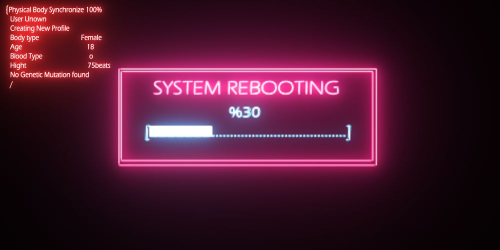
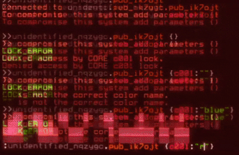
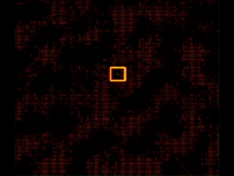
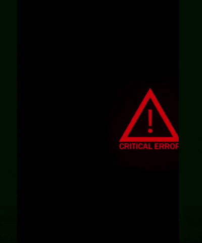
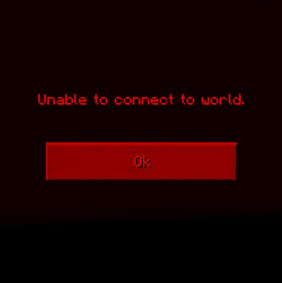

<div align="center">


<br>

`SOFTWARE ENGINEERING` &nbsp;·&nbsp; `AI / ML` &nbsp;·&nbsp; `RESEARCH`

<br>


<br>



<br><br>


<br><br>

<a href="mailto:ahmedfaiza256@gmail.com"></a>
<a href="https://github.com/FaizaEsha"></a>
<a href="https://www.facebook.com/faizavibes"></a>

</div>

<br>


<br>

<div align="center">

```text
╔══════════════════════════════════════════════════════════════╗
║  SYSTEM PROFILE                                              ║
╠══════════════════════════════════════════════════════════════╣
║  USER        : FAIZA AHMED ESHA                              ║
║  ROLE        : CSE UNDERGRADUATE                             ║
║  INSTITUTION : UNIVERSITY OF ASIA PACIFIC                    ║
║  SPECIALTY   : SOFTWARE / AI / RESEARCH                      ║
║  STATUS      : BUILDING                                      ║
╚══════════════════════════════════════════════════════════════╝
```

</div>

<br>

## `[ 01 // ABOUT ]`

<table>
<tr>
<td width="55%" valign="top">

I'm **Faiza Ahmed Esha**, a CSE undergraduate at the **University of Asia Pacific**, building software and exploring intelligent systems.

My interests sit at the intersection of:

```text
software engineering
        +
full-stack development
        +
artificial intelligence
        +
machine learning
        +
deep learning
        +
research & experimentation
```

I enjoy turning ideas into working systems, experimenting with different approaches, and **learning from the process**.

```text
LEARNING  →  BUILDING  →  RESEARCHING  →  ITERATING
```

</td>
<td width="45%" align="center" valign="middle">



<br><br>

<sub>`USER://FAIZA`</sub><br>
<sub>`ACCESS://GRANTED`</sub><br>
<sub>`STATUS://ONLINE`</sub>

</td>
</tr>
</table>

<br>

```text
[ OK ] software engineering
[ OK ] full-stack development
[ OK ] artificial intelligence
[ OK ] machine learning
[ OK ] deep learning
[ OK ] research & experimentation
[ .. ] becoming dangerously good at debugging
```


<br>

<div align="center">

## `[ 02 // BREACH DETECTED ]`



<sub>`INTRUDER GAINING ACCESS TO...` **`TECH STACK`**</sub>

</div>

<br>

## `[ 03 // TECH STACK ]`

<div align="center">

**LANGUAGES**


<br><br>

**DEVELOPMENT**


<br><br>

**AI / ML**


<br><br>


<br><br>

**CREATIVE TOOLS**


</div>


<br>

## `[ 04 // SELECTED PROJECTS ]`

<table>
<tr>
<td width="50%" valign="top">

### `01` **PROTISRUTI**

> A web platform designed to connect survivors with verified counselors while supporting confidential appointment scheduling.

**TECH** &nbsp; `Python` `Django`

<a href="https://github.com/FaizaEsha/Protisruti-NGO"></a>

</td>
<td width="50%" valign="top">

### `02` **PERSONAL PORTFOLIO**

> A personal portfolio built to showcase my work, technical interests, and developer journey.

**TECH** &nbsp; `HTML` `CSS`

<a href="https://github.com/FaizaEsha/ESHA"></a>

</td>
</tr>
<tr>
<td width="50%" valign="top">

### `03` **PING PONG GAME**

> A desktop Ping-Pong game developed using Java and Java Swing.

**TECH** &nbsp; `Java` `Java Swing`

<a href="https://github.com/FaizaEsha/Ping-Pong-Game"></a>

</td>
<td width="50%" valign="top">

### `04` **MORE INCOMING**

> Experiments, coursework, technical explorations, and research-oriented projects are continuously being added.

<a href="https://github.com/FaizaEsha?tab=repositories"></a>

</td>
</tr>
</table>


<br>

## `[ 05 // CURRENT MISSION ]`

<table>
<tr>
<td width="58%" valign="top">

```text
╔══════════════════════════════════════════════╗
║  CURRENT MISSION                             ║
║  [01] strengthen software engineering        ║
║  [02] explore AI / ML systems                ║
║  [03] deepen research skills                 ║
║  [04] build meaningful projects              ║
║  [05] find problems worth solving            ║
╚══════════════════════════════════════════════╝
```

</td>
<td width="42%" align="center" valign="middle">



<br>

<sub>**`WARNING:`** `DEADLINES.EXE APPROACHING`</sub>

</td>
</tr>
</table>

<br>

<div align="center">

## `[ 06 // GITHUB ACTIVITY ]`


<br><br>


</div>

<br>

## `[ 07 // CONTRIBUTION MATRIX ]`

<div align="center">

<sub>`COMMITS DETECTED // ACTIVITY VISUALIZED`</sub>

<br><br>

<picture>
  <source media="(prefers-color-scheme: dark)" srcset="https://raw.githubusercontent.com/FaizaEsha/FaizaEsha/output/github-snake-dark.svg">
  <source media="(prefers-color-scheme: light)" srcset="https://raw.githubusercontent.com/FaizaEsha/FaizaEsha/output/github-snake.svg">
  
</picture>

</div>


<br>

<div align="center">



<br><br>

```text
[ CONNECTION STATUS ]

NETWORK      : ONLINE
CREATIVITY   : ONLINE
CURIOSITY    : ONLINE
COFFEE       : CRITICAL
DEADLINES    : APPROACHING
```

<br>


<br><br>

<a href="mailto:ahmedfaiza256@gmail.com"></a>

<br><br>

<sub>open to internships · collaborations · research · interesting engineering problems</sub>

<br><br>


<br>

<sub>`SYSTEM END // FAIZA.EXE`</sub>

</div>
